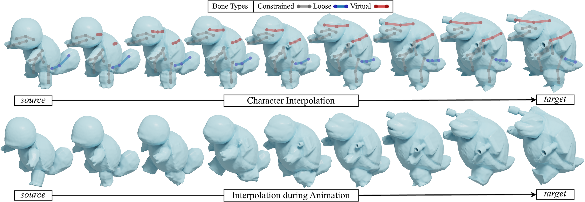

## CharacterMixer: Rig-Aware Interpolation of 3D Characters (Eurographics 2024)

This repository contains the implementation of our paper: 

**[CharacterMixer: Rig-Aware Interpolation of 3D Characters](https://seanxzhan.github.io/projects/CharacterMixer.html)**
<br>
[Xiao Zhan](https://seanzhan.com/),
[Rao Fu](https://freddierao.github.io/),
[Daniel Ritchie](https://dritchie.github.io/)



### Setup

```
cd CharacterMixer
conda env create -f env.yml
pip install -e .
```

### Data

We use [RigNet](https://github.com/zhan-xu/RigNet)'s dataset. Use `data_prep/save_skel_info.py` to preprocess `.fbx` model files and output `.json` files containing bone geometry. Change `data_dir` in `data_prep/save_skel_info.py` accordingly. After preprocessing, an example directory looks like
```
data
|- fbx  # RigNet .fbx files
|- obj  # RigNet .obj files
|- rig  # RigNet .txt files
|- skel # Output .json files
```
Change the `raw_data_dir` variable in `mixer_interp/__init__.py` accordingly after preprocessing data.

### Interpolation in Rest Pose

To interpolate two characters, use the following template in `run.sh`. Note `seq_id=0` means rest pose.
```
src_id=432 dest_id=1299 res=128 seq_id=0 num_interp=10 frame_start=1 frame_end=11 interp_step=5 fix_t=0
```
In this example, characters with IDs 432 and 1299 are interpolated with a grid resolution of 128^3. There are 10 interpolation steps with the first frame being 1 and last frame being 11. Since we are not fixing the interpolation time (`fix_t=0`), `interp_step` doesn't affect the code. If we want an interpolated character at timestep 5 to perform a motion sequence, we would set `interp_step=5 fix_t=1`.

Create an empty `tmp` directory and run the following to obtain interpolated geometry. Progress will be saved in `tmp/pose_interp.out` and `tmp/clean_mesh.out`.
```
# Generates geometry
bash run.sh 1
# Cleans geometry
bash run.sh 2
```

### Interpolation during a Motion Sequence

To interpolate two characters during a motion sequence, use the following template in run.sh.
```
src_id=432 dest_id=1299 res=128 seq_id=1 num_interp=21 frame_start=1 frame_end=50 interp_step=5 fix_t=0
```
Again, run `bash run.sh 1` and `bash run.sh 2` to obtain interpolated geometry. This will use the existing animations saved as `anims/*.npz` files containing bone rotations per frame.

### Create Your Own Animation

If you would like to pose a unified skeleton and create your own animation, follow these steps:

1. Run "Interpolation in Rest Pose"
2. Use `pose_char/blender_export.py` to export a specific unified skeleton to a Blender file.
3. Animate the skeleton in Blender.
4. Use `pose_char/blender_to_rot_mats.py` to export a `.npz` file containing the bone rotations for each animation frame. Move the `.npz` file to the `anims` directory.
5. Specify the variables in `run.sh` and run it, following "Interpolation during a Motion Sequence".

### Citation

Please consider citing our work! 

```
@article{https://doi.org/10.1111/cgf.15047,
author = {Zhan, Xiao and Fu, Rao and Ritchie, Daniel},
title = {CharacterMixer: Rig-Aware Interpolation of 3D Characters},
journal = {Computer Graphics Forum},
volume = {43},
number = {2},
pages = {e15047},
keywords = {CCS Concepts, • Computing methodologies → Shape analysis, Shape modeling},
doi = {https://doi.org/10.1111/cgf.15047},
url = {https://onlinelibrary.wiley.com/doi/abs/10.1111/cgf.15047},
eprint = {https://onlinelibrary.wiley.com/doi/pdf/10.1111/cgf.15047},
}
```